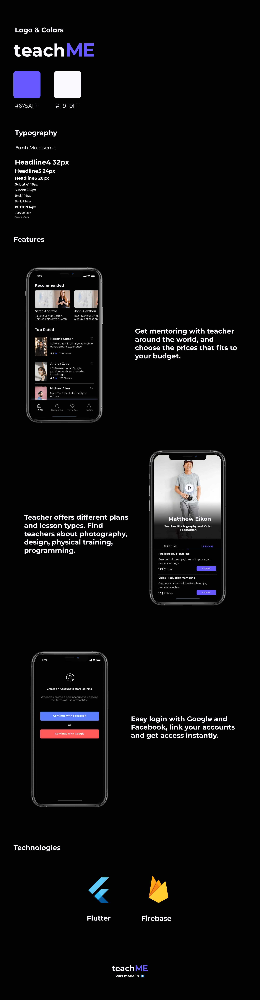

# teachME - Flutter Hackaton 2020  

The teachME is an open-source project to help people around the world to get incomes throught share the knowledge. 

This project was designed with FIGMA. 

### Technologies
<ol><li>Cloud Firestore Database</li><li>Google and Facebook Authentication</li></ol>

## Watch the video

## Download the Android APK

## Credits
Made in Guatemala by Roberto, Angel y Javier. 
